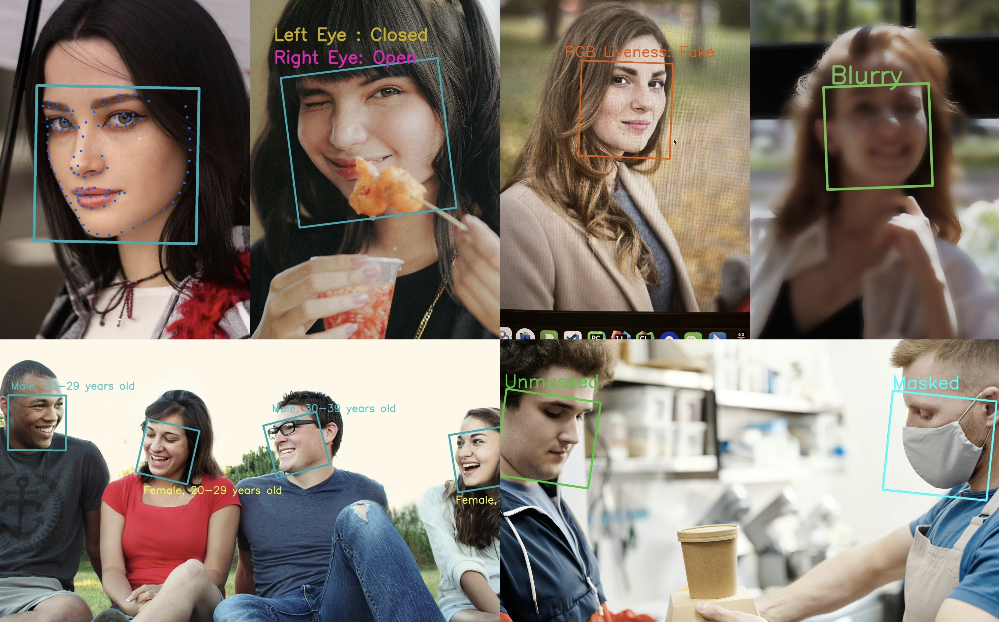

# InspireFace
[](https://github.com/HyperInspire/InspireFace/releases/latest)
[](https://img.shields.io/github/actions/workflow/status/HyperInspire/InspireFace/release-sdks.yaml?&style=for-the-badge&label=build)
[](https://img.shields.io/github/actions/workflow/status/HyperInspire/InspireFace/test_ubuntu_x86_Pikachu.yaml?&style=for-the-badge&label=test)

InspireFace is a cross-platform face recognition SDK developed in C/C++, supporting multiple operating systems and various backend types for inference, such as CPU, GPU, and NPU.

If you require further information on tracking development branches, CI/CD processes, or downloading pre-compiled libraries, please visit our [development repository](https://github.com/HyperInspire/InspireFace).

Please contact [contact@insightface.ai](mailto:contact@insightface.ai?subject=InspireFace) for commercial support, including obtaining and integrating higher accuracy models, as well as custom development.



## Change Logs

**`2024-08-18`** Updating [Benchmark](doc/Benchmark-Remark(Updating).md): Using CoreML with Apple's Neural Engine (ANE) on the iPhone 13, the combined processes of **Face Detection** + **Alignment** + **Feature Extraction** take less than **2ms**.

**`2024-07-17`** Add global resource statistics monitoring to prevent memory leaks.

**`2024-07-07`** Add some face action detection to the face interaction module.

**`2024-07-05`** Fixed some bugs in the python ctypes interface.

**`2024-07-03`** Add the blink detection algorithm of face interaction module.

**`2024-07-02`** Fixed several bugs in the face detector with multi-level input.

**`2024-06-27`** Verified iOS usability and fixed some bugs.

**`2024-06-18`** Added face detection feature with tracking-by-detection mode.

**`2024-06-01`** Adapted for accelerated inference on CUDA-enabled devices.

## 1. Preparation
### 1.1. Clone 3rdparty

Clone the `3rdparty` repository from the remote repository into the root directory of the project. Note that this repository contains some submodules. When cloning, you should use the `--recurse-submodules` parameter, or after entering the directory, use `git submodule update --init --recursive` to fetch and synchronize the latest submodules:

```Bash
# Must enter this directory
cd InspireFace
# Clone the repository and pull submodules
git clone --recurse-submodules https://github.com/HyperInspire/3rdparty.git
```

If you need to update the `3rdparty` repository to ensure it is current, or if you didn't use the `--recursive` parameter during the initial pull, you can run `git submodule update --init --recursive`:

```bash
# Must enter this directory
cd InspireFace
# If you're not using recursive pull
git clone https://github.com/HyperInspire/3rdparty.git

cd 3rdparty
git pull
# Update submodules
git submodule update --init --recursive
```

### 1.2. Downloading Model Package Files

You can download the model package files containing models and configurations needed for compilation from [Google Drive](https://drive.google.com/drive/folders/1krmv9Pj0XEZXR1GRPHjW_Sl7t4l0dNSS?usp=sharing) and extract them to any location.

### 1.3. Installing OpenCV
If you intend to use the SDK locally or on a server, ensure that OpenCV is installed on the host device beforehand to enable successful linking during the compilation process. For cross-compilation targets like Android or ARM embedded boards, you can use the pre-compiled OpenCV libraries provided by **3rdparty/inspireface-precompile/opencv/**.

### 1.4. Installing MNN
The '**3rdparty**' directory already includes the MNN library and specifies a particular version as the stable version. If you need to enable or disable additional configuration options during compilation, you can refer to the CMake Options provided by MNN. If you need to use your own precompiled version, feel free to replace it.

### 1.5. Requirements

- CMake (version 3.10 or higher)
- OpenCV (version 3.5 or higher)
    - Use the specific OpenCV-SDK supported by each target platform such as Android, iOS, and Linux.
- NDK (version 16 or higher, only required for Android)
- MNN (version 1.4.0 or higher)
- C++ Compiler
    - Either GCC or Clang can be used (macOS does not require additional installation as Xcode is included)
        - Recommended GCC version is 4.9 or higher
            - Note that in some distributions, GCC (GNU C Compiler) and G++ (GNU C++ Compiler) are installed separately.
            - For instance, on Ubuntu, you need to install both gcc and g++
        - Recommended Clang version is 3.9 or higher
    - arm-linux-gnueabihf (for RV1109/RV1126)
        - Prepare the cross-compilation toolchain in advance, such as gcc-arm-8.3-2019.03-x86_64-arm-linux-gnueabihf
- CUDA (version 10.1 or higher)
    - GPU-based inference requires installing NVIDIA's CUDA dependencies on the device.
- Eigen3
    - If you need to use the tracking-by-detection feature, you must have Eigen3 installed in advance.

- RKNN
    - Adjust and select versions currently supported for specific requirements.

## 2. Compilation
CMake option are used to control the various details of the compilation phase. Please select according to your actual requirements. [CMake Option](doc/CMake-Option.md).

### 2.1. Local Compilation
Make sure OpenCV is installed, you can begin the compilation process.  If you are using macOS or Linux, you can quickly compile using the shell scripts provided in the `command` folder at the project root:
```bash
cd InspireFace/
# Execute the local compilation script
bash command/build.sh
```
After compilation, you can find the local file in the build directory, which contains the compilation results. The install directory structure is as follows:
```bash
inspireface-linux
   ├── include
   │   ├── herror.h
   │   └── inspireface.h
   └── lib
       └── libInspireFace.so
```

- **libInspireFace.so**：Compiled dynamic linking library.
- **inspireface.h**：Header file definition.
- **herror.h**：Reference error number definition.
### 2.2. Cross Compilation
Cross compilation requires you to prepare the target platform's cross-compilation toolchain on the host machine in advance. Here, compiling for Rockchip's embedded devices RV1109/RV1126 is used as an example:
```bash
# Set the path for the cross-compilation toolchain
export ARM_CROSS_COMPILE_TOOLCHAIN=YOUR_DIR/gcc-arm-8.3-2019.03-x86_64-arm-linux-gnueabihf
# Execute the cross-compilation script for RV1109/RV1126
bash command/build_cross_rv1109rv1126_armhf.sh
```
After the compilation is complete, you can find the compiled results in the `build/inspireface-linux-armv7-rv1109rv1126-armhf` directory.

### 2.3. iOS Compilation

To compile for iOS, ensure you are using a Mac device. The script will automatically download third-party dependencies into the `.macos_cache` directory.

```
bash command/build_ios.sh
```

After the compilation is complete, `inspireface.framework` will be placed in the `build/inspireface-ios` directory.

### 2.4. Supported Platforms and Architectures
We have completed the adaptation and testing of the software across various operating systems and CPU architectures. This includes compatibility verification for platforms such as Linux, macOS, iOS, and Android, as well as testing for specific hardware support to ensure stable operation in diverse environments.

| **No.** | **Operating System** | **CPU Architecture** | **Special Device Support** | **Adapted** | **Passed Tests** |
| ------- | -------------------- | --------------------- | -------------------------- | ----------- | ---------------- |
| 1       | **Linux**            | ARMv7                 | -                          | [](https://github.com/HyperInspire/InspireFace/actions/workflows/release-sdks.yaml) |  |
| 2       |                      | ARMv8                 | -                          | [](https://github.com/HyperInspire/InspireFace/actions/workflows/release-sdks.yaml) |  |
| 3       |                      | x86/x86_64            | -                          | [](https://github.com/HyperInspire/InspireFace/actions/workflows/release-sdks.yaml) | [](https://github.com/HyperInspire/InspireFace/actions/workflows/test_ubuntu_x86_Pikachu.yaml) |
| 4       |                      | ARMv7                 | RV1109RV1126               | [](https://github.com/HyperInspire/InspireFace/actions/workflows/release-sdks.yaml) |  |
| 5       |                      | x86/x86_64            | CUDA                       |  |  |
| 6       | **macOS**            | Intel x86             | -                          |  |  |
| 7       |                      | Apple Silicon         | -                          |  |  |
| 8       | **iOS**              | ARM                   | -                          | [](https://github.com/HyperInspire/InspireFace/actions/workflows/release-sdks.yaml) |  |
| 9       | **Android**          | ARMv7                 | -                          | [](https://github.com/HyperInspire/InspireFace/actions/workflows/release-sdks.yaml) |  |
| 10      |                      | ARMv8                 | -                          | [](https://github.com/HyperInspire/InspireFace/actions/workflows/release-sdks.yaml) |  |

- Complete compilation scripts and successful compilation.
- Pass unit tests on physical devices.
- Meet all performance benchmarks in tests.

### 2.5. Multi-platform compilation using Docker

We offer a method for rapid multi-platform compilation using Docker, provided that Docker is installed beforehand, and the appropriate commands are executed:
```Bash
# Build x86 Ubuntu18.04
docker-compose up build-ubuntu18

# Build armv7 cross-compile
build-cross-armv7-armhf

# Build armv7 with support RV1109RV1126 device NPU cross-complie
docker-compose up build-cross-rv1109rv1126-armhf

# Build Android with support arm64-v8a and armeabi-v7a
docker-compose up build-cross-android

# Build all
docker-compose up
```

## 3. Example
### 3.1. C/C++ Sample
To integrate InspireFace into a C/C++ project, you simply need to link the InspireFace library and include the appropriate header files. Below is a basic example demonstrating face detection:

```cpp
HResult ret;
// The resource file must be loaded before it can be used
ret = HFLaunchInspireFace(packPath);
if (ret != HSUCCEED) {
    std::cout << "Load Resource error: " << ret << std::endl;
    return ret;
}

// Enable the functions in the pipeline: mask detection, live detection, and face quality detection
HOption option = HF_ENABLE_QUALITY | HF_ENABLE_MASK_DETECT | HF_ENABLE_LIVENESS;
// Non-video or frame sequence mode uses IMAGE-MODE, which is always face detection without tracking
HFDetectMode detMode = HF_DETECT_MODE_IMAGE;
// Maximum number of faces detected
HInt32 maxDetectNum = 5;
// Handle of the current face SDK algorithm context
HFSession session = {0};
ret = HFCreateInspireFaceSessionOptional(option, detMode, maxDetectNum, -1, -1, &session);
if (ret != HSUCCEED) {
    std::cout << "Create FaceContext error: " << ret << std::endl;
    return ret;
}

// Load a image
cv::Mat image = cv::imread(sourcePath);
if (image.empty()) {
    std::cout << "The source entered is not a picture or read error." << std::endl;
    return 1;
}
// Prepare an image parameter structure for configuration
HFImageData imageParam = {0};
imageParam.data = image.data;       // Data buffer
imageParam.width = image.cols;      // Target view width
imageParam.height = image.rows;      // Target view width
imageParam.rotation = HF_CAMERA_ROTATION_0;      // Data source rotate
imageParam.format = HF_STREAM_BGR;      // Data source format

// Create an image data stream
HFImageStream imageHandle = {0};
ret = HFCreateImageStream(&imageParam, &imageHandle);
if (ret != HSUCCEED) {
    std::cout << "Create ImageStream error: " << ret << std::endl;
    return ret;
}

// Execute HF_FaceContextRunFaceTrack captures face information in an image
HFMultipleFaceData multipleFaceData = {0};
ret = HFExecuteFaceTrack(session, imageHandle, &multipleFaceData);
if (ret != HSUCCEED) {
    std::cout << "Execute HFExecuteFaceTrack error: " << ret << std::endl;
    return ret;
}
// Print the number of faces detected
auto faceNum = multipleFaceData.detectedNum;
std::cout << "Num of face: " << faceNum << std::endl;

ret = HFReleaseImageStream(imageHandle);
if (ret != HSUCCEED) {
    printf("Release image stream error: %lu\n", ret);
}
// The memory must be freed at the end of the program
ret = HFReleaseInspireFaceSession(session);
if (ret != HSUCCEED) {
    printf("Release session error: %lu\n", ret);
    return ret;
}
```
For more examples, you can refer to the `cpp/sample` sub-project located in the root directory. You can compile these sample executables by enabling the `ISF_BUILD_WITH_SAMPLE` option during the compilation process.

**Note**: For each error code feedback, you can click on this [link](doc/Error-Feedback-Codes.md) to view detailed explanations.

### 3.2. Python Native Sample
We provide a Python API that allows for more efficient use of the InspireFace library. After compiling the dynamic link library, you need to either symlink or copy it to the `python/inspireface/modules/core` directory within the root directory. You can then start testing by navigating to the **[python/](python/)** directory. Your Python environment will need to have some dependencies installed:

- python >= 3.7
- opencv-python
- loguru
- tqdm
- numpy
- ctypes
```bash
# Use a symbolic link
ln -s YOUR_BUILD_DIR/install/InspireFace/lib/libInspireFace.so python/inspireface/modules/core
# Navigate to the sub-project directory
cd python

```

Import inspireface for a quick facial detection example:
```python
import cv2
import inspireface as ifac
from inspireface.param import *

# Step 1: Initialize the SDK and load the algorithm resource files.
resource_path = "pack/Pikachu"
ret = ifac.launch(resource_path)
assert ret, "Launch failure. Please ensure the resource path is correct."

# Optional features, loaded during session creation based on the modules specified.
opt = HF_ENABLE_NONE
session = ifac.InspireFaceSession(opt, HF_DETECT_MODE_IMAGE)

# Load the image using OpenCV.
image = cv2.imread(image_path)
assert image is not None, "Please check that the image path is correct."

# Perform face detection on the image.
faces = session.face_detection(image)
print(f"face detection: {len(faces)} found")

# Copy the image for drawing the bounding boxes.
draw = image.copy()
for idx, face in enumerate(faces):
    print(f"{'==' * 20}")
    print(f"idx: {idx}")
    # Print Euler angles of the face.
    print(f"roll: {face.roll}, yaw: {face.yaw}, pitch: {face.pitch}")
    # Draw bounding box around the detected face.
    x1, y1, x2, y2 = face.location
    cv2.rectangle(draw, (x1, y1), (x2, y2), (0, 0, 255), 2)
```
In the project, more usage examples are provided:

- sample_face_detection.py: Facial detection example
- sample_face_recognition.py: Facial recognition example
- sample_face_track_from_video.py: Facial tracking from video stream example

## 4. Test
In the project, there is a subproject called cpp/test. To compile it, you need to enable the ISF_BUILD_WITH_TEST switch, which will allow you to compile executable programs for testing.

```bash
cmake -DISF_BUILD_WITH_TEST=ON ..
```
If you need to run test cases, you will need to download the required [resource files](https://drive.google.com/drive/folders/1krmv9Pj0XEZXR1GRPHjW_Sl7t4l0dNSS?usp=sharing): **test_res**. Unzip the test_res folder. The directory structure of test_res should be prepared as follows before testing:

```bash

test_res
├── data
├── images
├── pack	<-- The model package files are here
├── save
├── valid_lfw_funneled.txt
├── video
└── video_frames

```
After compilation, you can find the executable program "**Test**" in `YOUR_BUILD_FOLDER/test`. The program accepts two optional parameters:

- **test_dir**：Path to the test resource files
- **pack**：Name of the model to be tested
```bash
./Test --test_dir PATH/test_res --pack Pikachu
```
During the process of building the test program using CMake, it will involve selecting CMake parameters. For specific details, you can refer to the parameter configuration table.

**Note**: If you want to view the benchmark test report, you can click on the [link](doc/Benchmark-Remark(Updating).md).

### Quick Test

If you need to perform a quick test, you can use the script we provide. This script will automatically download the test file `test_res` and build the test program to run the test. 

*Note: If you need to enable more comprehensive tests, you can adjust the options in the script as needed.*

```bash
# If you are using Ubuntu, you can execute this.
bash ci/quick_test_linux_x86_usual.sh

# If you are using another system (including Ubuntu), you can execute this.
bash ci/quick_test_local.sh
```

Every time code is committed, tests are run on GitHub Actions.

## 5. Function Support
The following functionalities and technologies are currently supported.

| Index | Function | Adaptation | Note |
| -- | --- | --- | --- |
| 1 | Face Detection |  | SCRFD |
| 2 | Facial Landmark Detection |  | HyperLandmark |
| 3 | Face Recognition |  | ArcFace |
| 4 | Face Tracking |  |  |
| 5 | Mask Detection |  |  |
| 6 | Silent Liveness Detection |  | MiniVision |
| 7 | Face Quality Detection |  |  |
| 8 | Face Pose Estimation |  |  |
| 9 | Face Attribute Prediction |  | Age, Race, Gender |
| 10 | Cooperative Liveness Detection |  | Blink |


## 6. Models Package List

For different scenarios, we currently provide several Packs, each containing multiple models and configurations.The package file is placed in the **pack** subdirectory under the **test_res** directory.

| Name | Supported Devices | Note | Link |
| --- | --- | --- | --- |
| Pikachu | CPU | Lightweight edge-side models | [GDrive](https://drive.google.com/drive/folders/1krmv9Pj0XEZXR1GRPHjW_Sl7t4l0dNSS?usp=sharing) |
| Megatron | CPU, GPU | Mobile and server models | [GDrive](https://drive.google.com/drive/folders/1krmv9Pj0XEZXR1GRPHjW_Sl7t4l0dNSS?usp=sharing) |
| Gundam-RV1109 | RKNPU | Supports RK1109 and RK1126 | [GDrive](https://drive.google.com/drive/folders/1krmv9Pj0XEZXR1GRPHjW_Sl7t4l0dNSS?usp=sharing) |

