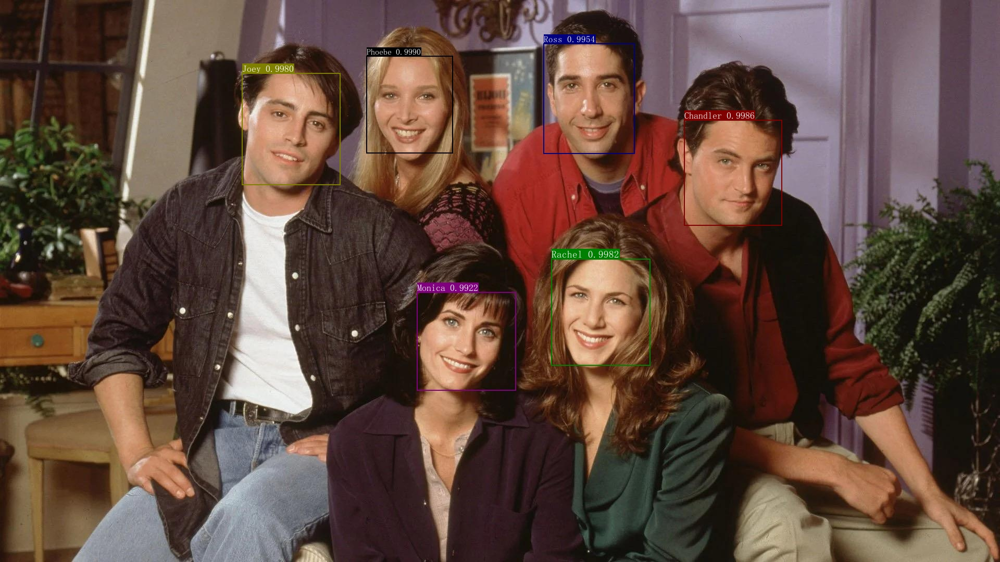

简体中文 | [English](./README_en.md)

# InsightFace Paddle

## 1. 介绍
`InsightFacePaddle`是基于PaddlePaddle实现的，开源深度人脸检测、识别工具。`InsightFacePaddle`目前提供了三个预训练模型，包括用于人脸检测的 `BlazeFace`、用于人脸识别的 `ArcFace` 和 `MobileFace`。

## 2. 环境准备

首先，请参照 [Installation](../install_ch.md) 配置实验所需环境。

## 3. 快速开始

可以在 `Python` 代码中使用 `InsightFacePaddle`。另外 `InsightFacePaddle` 也提供了 Python wheel 包，支持命令行使用以及Python代码调用，具体请参考 [InsightFacePaddle](https://github.com/littletomatodonkey/insight-face-paddle)。

在 Python 中使用 `InsightFacePaddle`。首先导入 `InsightFacePaddle`，因为 `InsightFacePaddle` 使用 `logging` 控制日志输入，因此需要导入 `logging`。

```python
import insightface_paddle as face
import logging
logging.basicConfig(level=logging.INFO)
```

### 3.1 获取参数信息

```python
parser = face.parser()
help_info = parser.print_help()
print(help_info)
```

`InsightFacePaddle` 的参数及其解释如下:
| 参数名（args） |  类型（type） | 默认值（default） | 说明（help） |
| ---- | ---- | ---- | ---- |
| det_model | str | BlazeFace | 检测模型名称，或本地模型文件所在目录，该目录下需包含 `inference.pdmodel`、`inference.pdiparams` 和 `inference.pdiparams.info` 三个文件。 |
| rec_model | str | MobileFace | 识别模型名称，或本地模型文件所在目录，该目录下需包含 `inference.pdmodel`、`inference.pdiparams` 和 `inference.pdiparams.info` 三个文件。 |
| use_gpu | bool | True | 是否使用 `GPU` 进行预测，默认为 `True`。 |
| enable_mkldnn | bool | False | 是否开启 `MKLDNN` 进行预测，当 `--use_gpu` 为 `False` 时该参数有效，默认值为 `False`。 |
| cpu_threads | int | 1 | CPU 预测时开启的线程数量，当 `--use_gpu` 为 `False` 且 `--enable_mkldnn` 为 `True` 时该参数有效，默认值为 `1`。 |
| input | str | - | 要预测的视频文件或图像文件的路径，或包含图像文件的目录。 |
| output | str | - | 保存预测结果的目录。|
| det | bool | False | 是否进行检测。 |
| det_thresh | float | 0.8 | 检测后处理的阈值，默认值为`0.8`。 |
| rec | bool | False | 是否进行识别。 |
| index | str | - | 索引文件的路径。 |
| cdd_num | int | 10 | 识别中检索阶段的候选数量，默认值为`10`。 |
| rec_thresh | float | 0.4 | 识别中的检索阈值，由于剔除相似度过低的候选项。默认值为`0.4`。 |
| max_batch_size | int | 1 | 识别中 batch_size 上限，默认值为`1`。 |
| build_index | str | - | 要构建的索引文件路径。 |
| img_dir | str | - | 用于构建索引的图像文件目录。 |
| label | str | - | 用于构建索引的标签文件路径。 |

### 3.2 构建索引

如果使用识别功能，则必须提供索引文件，我们提供了演示示例所需的索引文件：`./demo/friends/index.bin`。如有需要，示例数据集和构建索引文件的相关命令请参考[InsightFacePaddle](https://github.com/littletomatodonkey/insight-face-paddle)。

### 3.3 预测

1. 仅检测

* Image(s)

使用下图进行测试：
<div align="center">

</div>

预测命令如下：
```python
parser = face.parser()
args = parser.parse_args()

args.det = True
args.output = "./output"
input_path = "./demo/friends/query/friends1.jpg"

predictor = face.InsightFace(args)
res = predictor.predict(input_path)
print(next(res))
```

检测结果图位于路径 `./output` 下，预测结果的示例图如下所示：
<div align="center">

</div>

* NumPy
```python
import cv2

parser = face.parser()
args = parser.parse_args()

args.det = True
args.output = "./output"
path = "./demo/friends/query/friends1.jpg"
img = cv2.imread(path)[:, :, ::-1]

predictor = face.InsightFace(args)
res = predictor.predict(img)
print(next(res))
```

* Video
```python
parser = face.parser()
args = parser.parse_args()

args.det = True
args.output = "./output"
input_path = "./demo/friends/query/friends.mp4"

predictor = face.InsightFace(args)
res = predictor.predict(input_path, print_info=True)
for _ in res:
    pass
```

2. 仅识别

下述示例使用我们提供的索引文件（`./demo/friends/index.bin`）进行演示。

* Image(s)

使用下图进行测试：
<div align="center">

</div>

预测命令如下：
```python
parser = face.parser()
args = parser.parse_args()

args.rec = True
args.index = "./demo/friends/index.bin"
input_path = "./demo/friends/query/Rachel.png"

predictor = face.InsightFace(args)
res = predictor.predict(input_path, print_info=True)
next(res)
```

检测结果输出在终端中：
```bash
INFO:root:File: Rachel.png, predict label(s): ['Rachel']
```

* NumPy
```python
import cv2

parser = face.parser()
args = parser.parse_args()

args.rec = True
args.index = "./demo/friends/index.bin"
path = "./demo/friends/query/Rachel.png"
img = cv2.imread(path)[:, :, ::-1]

predictor = face.InsightFace(args)
res = predictor.predict(img, print_info=True)
next(res)
```

3. 检测+识别系统串联

下述示例使用我们提供的索引文件（`./demo/friends/index.bin`）进行演示。

* Image(s)

使用下图进行测试：
<div align="center">

</div>

预测命令如下：
```python
parser = face.parser()
args = parser.parse_args()

args.det = True
args.rec = True
args.index = "./demo/friends/index.bin"
args.output = "./output"
input_path = "./demo/friends/query/friends2.jpg"

predictor = face.InsightFace(args)
res = predictor.predict(input_path, print_info=True)
next(res)
```

检测结果图位于路径 `./output` 下，预测结果的示例图如下所示：
<div align="center">

</div>


* NumPy
```python
import cv2

parser = face.parser()
args = parser.parse_args()

args.det = True
args.rec = True
args.index = "./demo/friends/index.bin"
args.output = "./output"
path = "./demo/friends/query/friends1.jpg"
img = cv2.imread(path)[:, :, ::-1]

predictor = face.InsightFace(args)
res = predictor.predict(img, print_info=True)
next(res)
```

* Video
```python
parser = face.parser()
args = parser.parse_args()

args.det = True
args.rec = True
args.index = "./demo/friends/index.bin"
args.output = "./output"
input_path = "./demo/friends/query/friends.mp4"

predictor = face.InsightFace(args)
res = predictor.predict(input_path, print_info=True)
for _ in res:
    pass
```
