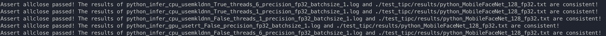
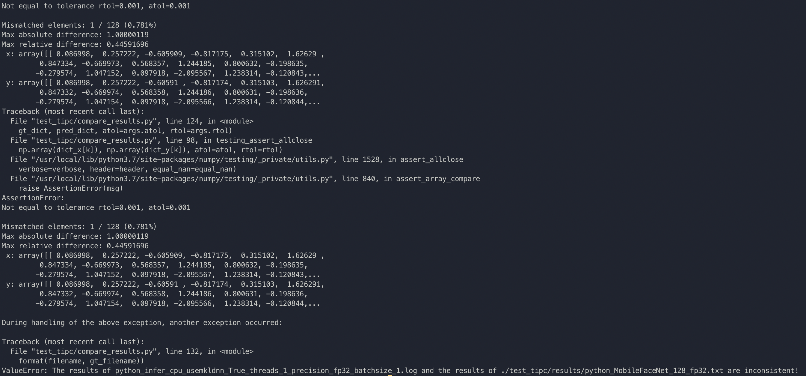

# Linux端基础训练预测功能测试

Linux端基础训练预测功能测试的主程序为`test_train_inference_python.sh`，可以测试基于Python的模型训练、评估、推理等基本功能。

- Mac端基础训练预测功能测试参考[链接](./mac_test_train_inference_python.md)
- Windows端基础训练预测功能测试参考[链接](./win_test_train_inference_python.md)

## 1. 测试结论汇总

- 训练相关：

| 算法名称 | 模型名称 | 单机单卡 | 单机多卡 | 多机多卡 | 模型压缩（单机多卡） |
|  :----  |   :----  |    :----  |  :----   |  :----   |  :----   |
|  ArcFace  | ms1mv2_mobileface| 正常训练| 正常训练 | 正常训练 | - |


- 预测相关：预测功能汇总如下，

| 模型类型 |device | batchsize | tensorrt | mkldnn | cpu多线程 |
|  ----   |  ---- |   ----   |  :----:  |   :----:   |  :----:  |
| 正常模型 | GPU | 1 | fp32 | - | - |
| 正常模型 | CPU | 1 | - | fp32 | 支持 |


## 2. 测试流程

运行环境配置请参考[文档](./install.md)的内容配置tipc的运行环境。

### 2.1 安装依赖
- 安装PaddlePaddle >= 2.2
- 安装依赖
    ```
    pip3 install  -r requirements.txt
    ```
- 安装autolog（规范化日志输出工具）
    ```
    pip3 install git+https://github.com/LDOUBLEV/AutoLog --force-reinstall
    ```

### 2.2 功能测试
先运行`prepare.sh`准备数据和模型，然后运行`test_train_inference_python.sh`进行测试，最终在```test_tipc/output```目录下生成`python_infer_*.log`格式的日志文件。


`test_train_inference_python.sh`包含5种运行模式，每种模式的运行数据不同，分别用于测试速度和精度，分别是：

- 模式1：lite_train_lite_infer，使用少量数据训练，用于快速验证训练到预测的走通流程，不验证精度和速度；
```shell
bash test_tipc/prepare.sh ./test_tipc/configs/ms1mv2_mobileface.txt 'lite_train_lite_infer'
bash test_tipc/test_train_inference_python.sh ./test_tipc/configs/ms1mv2_mobileface.txt 'lite_train_lite_infer'
```  

- 模式2：lite_train_whole_infer，使用少量数据训练，一定量数据预测，用于验证训练后的模型执行预测，预测速度是否合理；
```shell
bash test_tipc/prepare.sh ./test_tipc/configs/ms1mv2_mobileface.txt 'lite_train_whole_infer'
bash test_tipc/test_train_inference_python.sh ./test_tipc/configs/ms1mv2_mobileface.txt 'lite_train_whole_infer'
```  

- 模式3：whole_infer，不训练，全量数据预测，走通开源模型评估、动转静，检查inference model预测时间和精度;
```shell
bash test_tipc/prepare.sh ./test_tipc/configs/ms1mv2_mobileface.txt 'whole_infer'
# 用法1:
bash test_tipc/test_train_inference_python.sh ./test_tipc/configs/ms1mv2_mobileface.txt 'whole_infer'
# 用法2: 指定GPU卡预测，第三个传入参数为GPU卡号
bash test_tipc/test_train_inference_python.sh ./test_tipc/configs/ms1mv2_mobileface.txt 'whole_infer' '1'
```  

- 模式4：whole_train_whole_infer，CE： 全量数据训练，全量数据预测，验证模型训练精度，预测精度，预测速度；
```shell
bash test_tipc/prepare.sh ./test_tipc/configs/ms1mv2_mobileface.txt 'whole_train_whole_infer'
bash test_tipc/test_train_inference_python.sh ./test_tipc/configs/ms1mv2_mobileface.txt 'whole_train_whole_infer'
```  

运行相应指令后，在`test_tipc/output`文件夹下自动会保存运行日志。如'lite_train_lite_infer'模式下，会运行训练+inference的链条，因此，在`test_tipc/output`文件夹有以下文件：
```
test_tipc/output/
|- results_python.log    # 运行指令状态的日志
|- norm_train_gpus_0_autocast_null_fp16_False/  # GPU 0号卡上正常训练的训练日志和模型保存文件夹
|- norm_train_gpus_0_autocast_null_fp16_Trule/  # GPU 0号卡上fp16训练的训练日志和模型保存文件夹
......
|- python_infer_cpu_usemkldnn_True_threads_1_precision_fp32_batchsize_1.log  # CPU上开启Mkldnn线程数设置为1，测试batch_size=1条件下的预测运行日志
|- python_infer_gpu_usetrt_True_precision_fp32_batchsize_1.log # GPU上开启TensorRT，测试batch_size=1的预测日志
......
```

其中`results_python.log`中包含了每条指令的运行状态，如果运行成功会输出：
```
Run successfully with command - python3.7 tools/train.py --config_file=configs/ms1mv2_mobileface.py --is_static=False --embedding_size=128 --fp16=False --dataset=MS1M_v2 --data_dir=MS1M_v2/ --label_file=MS1M_v2/label.txt --num_classes=85742 --log_interval_step=1    --output=./test_tipc/output/norm_train_gpus_0_autocast_null_fp16_Trule --train_num=1       --fp16=Trule!
Run successfully with command - python3.7 tools/validation.py --is_static=False --backbone=MobileFaceNet_128 --embedding_size=128 --data_dir=MS1M_v2 --val_targets=lfw --batch_size=128 --checkpoint_dir=./test_tipc/output/norm_train_gpus_0_autocast_null_fp16_Trule/MobileFaceNet_128/0    !
......
```
如果运行失败，会输出：
```
Run failed with command - python3.7 tools/train.py --config_file=configs/ms1mv2_mobileface.py --is_static=False --embedding_size=128 --fp16=False --dataset=MS1M_v2 --data_dir=MS1M_v2/ --label_file=MS1M_v2/label.txt --num_classes=85742 --log_interval_step=1    --output=./test_tipc/output/norm_train_gpus_0_autocast_null_fp16_Trule --train_num=1       --fp16=Trule!
Run failed with command - python3.7 tools/validation.py --is_static=False --backbone=MobileFaceNet_128 --embedding_size=128 --data_dir=MS1M_v2 --val_targets=lfw --batch_size=128 --checkpoint_dir=./test_tipc/output/norm_train_gpus_0_autocast_null_fp16_Trule/MobileFaceNet_128/0    !
......
```
可以很方便的根据`results_python.log`中的内容判定哪一个指令运行错误。


### 2.3 精度测试

使用compare_results.py脚本比较模型预测的结果是否符合预期，主要步骤包括：
- 提取日志中的预测坐标；
- 从本地文件中提取保存好的坐标结果；
- 比较上述两个结果是否符合精度预期，误差大于设置阈值时会报错。

#### 使用方式
运行命令：
```shell
python3.7 test_tipc/compare_results.py --gt_file=./test_tipc/results/python_*.txt  --log_file=./test_tipc/output/python_*.log --atol=1e-3 --rtol=1e-3
```

参数介绍：  
- gt_file： 指向事先保存好的预测结果路径，支持*.txt 结尾，会自动索引*.txt格式的文件，文件默认保存在test_tipc/result/ 文件夹下
- log_file: 指向运行test_tipc/test_train_inference_python.sh 脚本的infer模式保存的预测日志，预测日志中打印的有预测结果，比如：文本框，预测文本，类别等等，同样支持python_infer_*.log格式传入
- atol: 设置的绝对误差
- rtol: 设置的相对误差

#### 运行结果

正常运行效果如下图：


出现不一致结果时的运行输出：



## 3. 更多教程
本文档为功能测试用，更丰富的训练预测使用教程请参考：  
[模型训练与预测](https://github.com/WenmuZhou/insightface/blob/master/recognition/arcface_paddle/README_cn.md)  