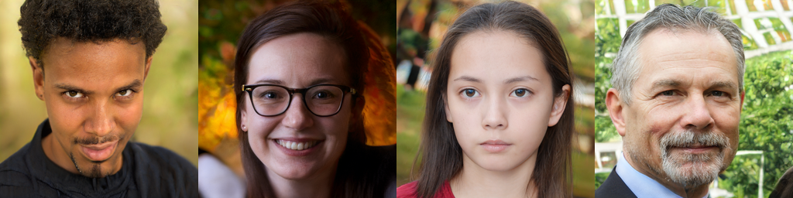
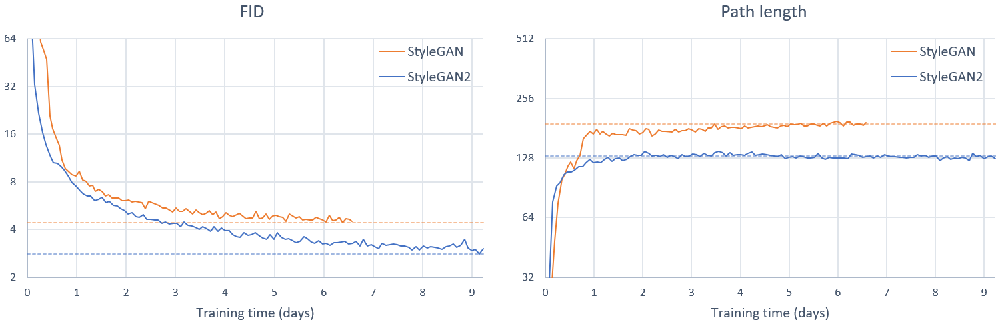

## StyleGAN2 &mdash; Official TensorFlow Implementation



**Analyzing and Improving the Image Quality of StyleGAN**<br>
Tero Karras, Samuli Laine, Miika Aittala, Janne Hellsten, Jaakko Lehtinen, Timo Aila<br>

Paper: http://arxiv.org/abs/1912.04958<br>
Video: https://youtu.be/c-NJtV9Jvp0<br>

Abstract: *The style-based GAN architecture (StyleGAN) yields state-of-the-art results in data-driven unconditional generative image modeling. We expose and analyze several of its characteristic artifacts, and propose changes in both model architecture and training methods to address them. In particular, we redesign generator normalization, revisit progressive growing, and regularize the generator to encourage good conditioning in the mapping from latent vectors to images. In addition to improving image quality, this path length regularizer yields the additional benefit that the generator becomes significantly easier to invert. This makes it possible to reliably detect if an image is generated by a particular network. We furthermore visualize how well the generator utilizes its output resolution, and identify a capacity problem, motivating us to train larger models for additional quality improvements. Overall, our improved model redefines the state of the art in unconditional image modeling, both in terms of existing distribution quality metrics as well as perceived image quality.*

For business inquiries, please visit our website and submit the form: [NVIDIA Research Licensing](https://www.nvidia.com/en-us/research/inquiries/)

**&#9733;&#9733;&#9733; NEW: [StyleGAN2-ADA-PyTorch](https://github.com/NVlabs/stylegan2-ada-pytorch) is now available; see the full list of versions [here](https://nvlabs.github.io/stylegan2/versions.html) &#9733;&#9733;&#9733;**

| Additional material | &nbsp;
| :--- | :----------
| [StyleGAN2](https://drive.google.com/open?id=1QHc-yF5C3DChRwSdZKcx1w6K8JvSxQi7) | Main Google Drive folder
| &boxvr;&nbsp; [stylegan2-paper.pdf](https://drive.google.com/open?id=1fnF-QsiQeKaxF-HbvFiGtzHF_Bf3CzJu) | High-quality version of the paper
| &boxvr;&nbsp; [stylegan2-video.mp4](https://drive.google.com/open?id=1f_gbKW6FUUHKkUxciJ_lQx29mCq_fSBy) | High-quality version of the video
| &boxvr;&nbsp; [images](https://drive.google.com/open?id=1Sak157_DLX84ytqHHqZaH_59HoEWzfB7) | Example images produced using our method
| &boxv;&nbsp; &boxvr;&nbsp;  [curated-images](https://drive.google.com/open?id=1ydWb8xCHzDKMTW9kQ7sL-B1R0zATHVHp) | Hand-picked images showcasing our results
| &boxv;&nbsp; &boxur;&nbsp;  [100k-generated-images](https://drive.google.com/open?id=1BA2OZ1GshdfFZGYZPob5QWOGBuJCdu5q) | Random images with and without truncation
| &boxvr;&nbsp; [videos](https://drive.google.com/open?id=1yXDV96SFXoUiZKU7AyE6DyKgDpIk4wUZ) | Individual clips of the video as high-quality MP4
| &boxur;&nbsp; [networks](https://nvlabs-fi-cdn.nvidia.com/stylegan2/networks/) | Pre-trained networks
| &ensp;&ensp; &boxvr;&nbsp;  stylegan2-ffhq-config-f.pkl | StyleGAN2 for <span style="font-variant:small-caps">FFHQ</span> dataset at 1024&times;1024
| &ensp;&ensp; &boxvr;&nbsp;  stylegan2-car-config-f.pkl | StyleGAN2 for <span style="font-variant:small-caps">LSUN Car</span> dataset at 512&times;384
| &ensp;&ensp; &boxvr;&nbsp;  stylegan2-cat-config-f.pkl | StyleGAN2 for <span style="font-variant:small-caps">LSUN Cat</span> dataset at 256&times;256
| &ensp;&ensp; &boxvr;&nbsp;  stylegan2-church-config-f.pkl | StyleGAN2 for <span style="font-variant:small-caps">LSUN Church</span> dataset at 256&times;256
| &ensp;&ensp; &boxvr;&nbsp;  stylegan2-horse-config-f.pkl | StyleGAN2 for <span style="font-variant:small-caps">LSUN Horse</span> dataset at 256&times;256
| &ensp;&ensp; &boxur;&nbsp;&#x22ef;  | Other training configurations used in the paper

## Requirements

* Both Linux and Windows are supported. Linux is recommended for performance and compatibility reasons.
* 64-bit Python 3.6 installation. We recommend Anaconda3 with numpy 1.14.3 or newer.
* We recommend TensorFlow 1.14, which we used for all experiments in the paper, but TensorFlow 1.15 is also supported on Linux. TensorFlow 2.x is not supported.
* On Windows you need to use TensorFlow 1.14, as the standard 1.15 installation does not include necessary C++ headers.
* One or more high-end NVIDIA GPUs, NVIDIA drivers, CUDA 10.0 toolkit and cuDNN 7.5. To reproduce the results reported in the paper, you need an NVIDIA GPU with at least 16 GB of DRAM.
* Docker users: use the [provided Dockerfile](./Dockerfile) to build an image with the required library dependencies.

StyleGAN2 relies on custom TensorFlow ops that are compiled on the fly using [NVCC](https://docs.nvidia.com/cuda/cuda-compiler-driver-nvcc/index.html). To test that your NVCC installation is working correctly, run:

```.bash
nvcc test_nvcc.cu -o test_nvcc -run
| CPU says hello.
| GPU says hello.
```

On Windows, the compilation requires Microsoft Visual Studio to be in `PATH`. We recommend installing [Visual Studio Community Edition](https://visualstudio.microsoft.com/vs/) and adding into `PATH` using `"C:\Program Files (x86)\Microsoft Visual Studio\2019\Community\VC\Auxiliary\Build\vcvars64.bat"`.

## Using pre-trained networks

Pre-trained networks are stored as `*.pkl` files on the [StyleGAN2 Google Drive folder](https://drive.google.com/open?id=1QHc-yF5C3DChRwSdZKcx1w6K8JvSxQi7). Below, you can either reference them directly using the syntax `gdrive:networks/<filename>.pkl`, or download them manually and reference by filename.

```.bash
# Generate uncurated ffhq images (matches paper Figure 12)
python run_generator.py generate-images --network=gdrive:networks/stylegan2-ffhq-config-f.pkl \
  --seeds=6600-6625 --truncation-psi=0.5

# Generate curated ffhq images (matches paper Figure 11)
python run_generator.py generate-images --network=gdrive:networks/stylegan2-ffhq-config-f.pkl \
  --seeds=66,230,389,1518 --truncation-psi=1.0

# Generate uncurated car images
python run_generator.py generate-images --network=gdrive:networks/stylegan2-car-config-f.pkl \
  --seeds=6000-6025 --truncation-psi=0.5

# Example of style mixing (matches the corresponding video clip)
python run_generator.py style-mixing-example --network=gdrive:networks/stylegan2-ffhq-config-f.pkl \
  --row-seeds=85,100,75,458,1500 --col-seeds=55,821,1789,293 --truncation-psi=1.0
```

The results are placed in `results/<RUNNING_ID>/*.png`. You can change the location with `--result-dir`. For example, `--result-dir=~/my-stylegan2-results`.

You can import the networks in your own Python code using `pickle.load()`. For this to work, you need to include the `dnnlib` source directory in `PYTHONPATH` and create a default TensorFlow session by calling `dnnlib.tflib.init_tf()`. See [run_generator.py](./run_generator.py) and [pretrained_networks.py](./pretrained_networks.py) for examples.

## Preparing datasets

Datasets are stored as multi-resolution TFRecords, similar to the [original StyleGAN](https://github.com/NVlabs/stylegan). Each dataset consists of multiple `*.tfrecords` files stored under a common directory, e.g., `~/datasets/ffhq/ffhq-r*.tfrecords`. In the following sections, the datasets are referenced using a combination of `--dataset` and `--data-dir` arguments, e.g., `--dataset=ffhq --data-dir=~/datasets`.

**FFHQ**. To download the [Flickr-Faces-HQ](https://github.com/NVlabs/ffhq-dataset) dataset as multi-resolution TFRecords, run:

```.bash
pushd ~
git clone https://github.com/NVlabs/ffhq-dataset.git
cd ffhq-dataset
python download_ffhq.py --tfrecords
popd
python dataset_tool.py display ~/ffhq-dataset/tfrecords/ffhq
```

**LSUN**. Download the desired LSUN categories in LMDB format from the [LSUN project page](https://www.yf.io/p/lsun). To convert the data to multi-resolution TFRecords, run:

```.bash
python dataset_tool.py create_lsun_wide ~/datasets/car ~/lsun/car_lmdb --width=512 --height=384
python dataset_tool.py create_lsun ~/datasets/cat ~/lsun/cat_lmdb --resolution=256
python dataset_tool.py create_lsun ~/datasets/church ~/lsun/church_outdoor_train_lmdb --resolution=256
python dataset_tool.py create_lsun ~/datasets/horse ~/lsun/horse_lmdb --resolution=256
```

**Custom**. Create custom datasets by placing all training images under a single directory. The images must be square-shaped and they must all have the same power-of-two dimensions. To convert the images to multi-resolution TFRecords, run:

```.bash
python dataset_tool.py create_from_images ~/datasets/my-custom-dataset ~/my-custom-images
python dataset_tool.py display ~/datasets/my-custom-dataset
```

## Projecting images to latent space

To find the matching latent vectors for a set of images, run:

```.bash
# Project generated images
python run_projector.py project-generated-images --network=gdrive:networks/stylegan2-car-config-f.pkl \
  --seeds=0,1,5

# Project real images
python run_projector.py project-real-images --network=gdrive:networks/stylegan2-car-config-f.pkl \
  --dataset=car --data-dir=~/datasets
```

## Training networks

To reproduce the training runs for config F in Tables 1 and 3, run:

```.bash
python run_training.py --num-gpus=8 --data-dir=~/datasets --config=config-f \
  --dataset=ffhq --mirror-augment=true
python run_training.py --num-gpus=8 --data-dir=~/datasets --config=config-f \
  --dataset=car --total-kimg=57000
python run_training.py --num-gpus=8 --data-dir=~/datasets --config=config-f \
  --dataset=cat --total-kimg=88000
python run_training.py --num-gpus=8 --data-dir=~/datasets --config=config-f \
  --dataset=church --total-kimg 88000 --gamma=100
python run_training.py --num-gpus=8 --data-dir=~/datasets --config=config-f \
  --dataset=horse --total-kimg 100000 --gamma=100
```

For other configurations, see `python run_training.py --help`.

We have verified that the results match the paper when training with 1, 2, 4, or 8 GPUs. Note that training FFHQ at 1024&times;1024 resolution requires GPU(s) with at least 16 GB of memory. The following table lists typical training times using NVIDIA DGX-1 with 8 Tesla V100 GPUs:

| Configuration | Resolution      | Total kimg | 1 GPU   | 2 GPUs  | 4 GPUs  | 8 GPUs | GPU mem |
| :------------ | :-------------: | :--------: | :-----: | :-----: | :-----: | :----: | :-----: |
| `config-f`    | 1024&times;1024 | 25000      | 69d 23h | 36d 4h  | 18d 14h | 9d 18h | 13.3 GB |
| `config-f`    | 1024&times;1024 | 10000      | 27d 23h | 14d 11h | 7d 10h  | 3d 22h | 13.3 GB |
| `config-e`    | 1024&times;1024 | 25000      | 35d 11h | 18d 15h | 9d 15h  | 5d 6h  | 8.6 GB  |
| `config-e`    | 1024&times;1024 | 10000      | 14d 4h  | 7d 11h  | 3d 20h  | 2d 3h  | 8.6 GB  |
| `config-f`    | 256&times;256   | 25000      | 32d 13h | 16d 23h | 8d 21h  | 4d 18h | 6.4 GB  |
| `config-f`    | 256&times;256   | 10000      | 13d 0h  | 6d 19h  | 3d 13h  | 1d 22h | 6.4 GB  |

Training curves for FFHQ config F (StyleGAN2) compared to original StyleGAN using 8 GPUs:



After training, the resulting networks can be used the same way as the official pre-trained networks:

```.bash
# Generate 1000 random images without truncation
python run_generator.py generate-images --seeds=0-999 --truncation-psi=1.0 \
  --network=results/00006-stylegan2-ffhq-8gpu-config-f/networks-final.pkl
```

## Evaluation metrics

To reproduce the numbers for config F in Tables 1 and 3, run:

```.bash
python run_metrics.py --data-dir=~/datasets --network=gdrive:networks/stylegan2-ffhq-config-f.pkl \
  --metrics=fid50k,ppl_wend --dataset=ffhq --mirror-augment=true
python run_metrics.py --data-dir=~/datasets --network=gdrive:networks/stylegan2-car-config-f.pkl \
  --metrics=fid50k,ppl2_wend --dataset=car
python run_metrics.py --data-dir=~/datasets --network=gdrive:networks/stylegan2-cat-config-f.pkl \
  --metrics=fid50k,ppl2_wend --dataset=cat
python run_metrics.py --data-dir=~/datasets --network=gdrive:networks/stylegan2-church-config-f.pkl \
  --metrics=fid50k,ppl2_wend --dataset=church
python run_metrics.py --data-dir=~/datasets --network=gdrive:networks/stylegan2-horse-config-f.pkl \
  --metrics=fid50k,ppl2_wend --dataset=horse
```

For other configurations, see the [StyleGAN2 Google Drive folder](https://drive.google.com/open?id=1QHc-yF5C3DChRwSdZKcx1w6K8JvSxQi7).

Note that the metrics are evaluated using a different random seed each time, so the results will vary between runs. In the paper, we reported the average result of running each metric 10 times. The following table lists the available metrics along with their expected runtimes and random variation:

| Metric      | FFHQ config F  | 1 GPU  | 2 GPUs  | 4 GPUs | Description |
| :---------- | :------------: | :----: | :-----: | :----: | :---------- |
| `fid50k`    | 2.84 &pm; 0.03 | 22 min | 14 min  | 10 min | [Fr&eacute;chet Inception Distance](https://arxiv.org/abs/1706.08500)
| `is50k`     | 5.13 &pm; 0.02 | 23 min | 14 min  | 8 min  | [Inception Score](https://arxiv.org/abs/1606.03498)
| `ppl_zfull` | 348.0 &pm; 3.8 | 41 min | 22 min  | 14 min | [Perceptual Path Length](https://arxiv.org/abs/1812.04948) in Z, full paths
| `ppl_wfull` | 126.9 &pm; 0.2 | 42 min | 22 min  | 13 min | [Perceptual Path Length](https://arxiv.org/abs/1812.04948) in W, full paths
| `ppl_zend`  | 348.6 &pm; 3.0 | 41 min | 22 min  | 14 min | [Perceptual Path Length](https://arxiv.org/abs/1812.04948) in Z, path endpoints
| `ppl_wend`  | 129.4 &pm; 0.8 | 40 min | 23 min  | 13 min | [Perceptual Path Length](https://arxiv.org/abs/1812.04948) in W, path endpoints
| `ppl2_wend` | 145.0 &pm; 0.5 | 41 min | 23 min  | 14 min | [Perceptual Path Length](https://arxiv.org/abs/1812.04948) without center crop
| `ls`        | 154.2 / 4.27   | 10 hrs | 6 hrs   | 4 hrs  | [Linear Separability](https://arxiv.org/abs/1812.04948)
| `pr50k3`    | 0.689 / 0.492  | 26 min | 17 min  | 12 min | [Precision and Recall](https://arxiv.org/abs/1904.06991)

Note that some of the metrics cache dataset-specific data on the disk, and they will take somewhat longer when run for the first time.

## License

Copyright &copy; 2019, NVIDIA Corporation. All rights reserved.

This work is made available under the Nvidia Source Code License-NC. To view a copy of this license, visit https://nvlabs.github.io/stylegan2/license.html

## Citation

```
@inproceedings{Karras2019stylegan2,
  title     = {Analyzing and Improving the Image Quality of {StyleGAN}},
  author    = {Tero Karras and Samuli Laine and Miika Aittala and Janne Hellsten and Jaakko Lehtinen and Timo Aila},
  booktitle = {Proc. CVPR},
  year      = {2020}
}
```

## Acknowledgements

We thank Ming-Yu Liu for an early review, Timo Viitanen for his help with code release, and Tero Kuosmanen for compute infrastructure.