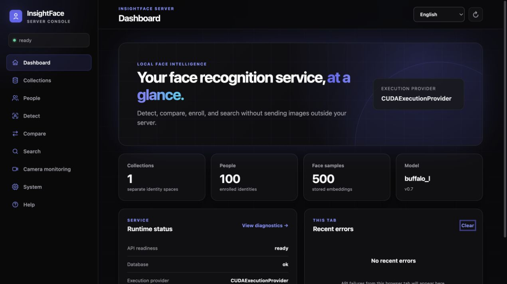

# InsightFace Server

**语言：** [English](README.md) · 中文 · [日本語](README.ja.md) · [Deutsch](README.de.md) · [Español](README.es.md) · [Français](README.fr.md) · [Русский](README.ru.md) · [Português](README.pt.md) · [한국어](README.ko.md)

> **单张 GPU，承载 50M+ 人脸向量，提供基于 INT8 特征量化的极速检索，精度无实质损失。**

**一个容器同时提供 Web UI、直观的 REST API、SQLite，以及本地 CPU 或
NVIDIA GPU 人脸识别推理。**

```text
上传图片 -> 检测、比对、注册或搜索
```

> **模型许可：** InsightFace 公开预训练模型通常仅限非商业研究用途。商业使用
> 需要单独授权，请前往 [InsightFace 官网](https://www.insightface.ai) 获取授权信息。

InsightFace Server 面向常见的人脸识别流程，是比 AWS Rekognition 更简单、
更注重数据隐私的自托管方案。图片、特征、模型和索引都可以留在自己的网络内。
它**不是** AWS 兼容替代品，不实现 SigV4、IAM、Region 或 AWS 资源语义。

当前版本：**0.2.0**，Linux x86_64。

| 运行环境 | 镜像 |
| --- | --- |
| CPU | `ghcr.io/deepinsight/insightface-server:0.2.0-cpu` |
| NVIDIA GPU | `ghcr.io/deepinsight/insightface-server:0.2.0-cuda12` |

滚动标签 `cpu` 和 `cuda12` 分别指向对应运行环境的最新稳定版本，不提供含义模糊的
`latest`。发布规则见[维护者指南（仅英文）](docs/maintainer-guide.md)。



## 功能概览

- SCRFD 人脸检测、五点关键点、对齐、ArcFace 特征、L2 normalization、原始
  cosine similarity 和精确 1:N Person 搜索。
- 多分辨率检测后合并执行一次 NMS，单脸策略支持 `largest` 和
  `center_largest`。
- `Collection -> Person -> FaceSample` 数据模型；Collection 绑定模型，多图片
  注册支持部分成功、metadata 和明确的拒绝原因。
- 注册 `review_mode` 支持 `off`、`standard`、`strict`，也支持
  `external_trusted` 外部可信特征。
- GPU 精确检索支持 FP32、FP16、BF16 和 INT8 向量存储。
- 多语言 Web UI 覆盖仪表盘、人员库、人员、人脸检测、比对、搜索、RTSP 监控、
  系统诊断和帮助。
- `/v1` 下提供 29 个 snake_case REST 接口，包括受保护的
  `/v1/embeddings`，并附带轻量 Python SDK。
- 服务端 RTSP Monitor 独立运行、保存有限的内存事件、支持多个客户端，并可选
  `preview.mjpeg`；关闭浏览器不会停止监控。
- SQLite 是持久化事实来源；内存精确索引可重建；`/models` 只读、`/data`
  持久化，并提供 migration、健康检查和禁止静默 CPU 回退的严格 CUDA 启动验证。
- 支持 JPEG、PNG 和 WebP；默认不保留原始上传图片。

### RTX 5090 GPU 检索性能

在单张 NVIDIA GeForce RTX 5090（32,607 MiB）上，原生 CUDA 精确全量扫描索引
使用 INT8 时，实测最多可保存 **58.9M 个 512 维图片特征向量**。

| GPU 数据类型 | 最大图片向量数 | 10M Top-5 p50 | 10M 串行 QPS |
| --- | ---: | ---: | ---: |
| FP32 | 15.8M | 12.84 ms | 77.85 |
| FP16 | 30.7M | 6.83 ms | 146.32 |
| BF16 | 30.7M | 6.83 ms | 146.33 |
| INT8 | **58.9M** | **3.84 ms** | **260.81** |

与 FP32 相比，INT8 的实测容量为 3.73 倍，10M Top-5 吞吐为 3.35 倍。以上
仅为同一张 RTX 5090、Driver 580.105.08、CUDA 12.9 上的 GPU 实测。容量是
未加载 ONNX 模型和 Server 工作负载时的独立原生索引极限；速度测试固定为
10M 个图片特征向量，执行 GPU 驻留的 Top-5 全量精确扫描，单请求串行，预热
10 次后测量 100 次。索引在各自存储表示内是精确搜索，但量化仍可能使分数
相对 FP32 发生变化。生产部署还必须为模型、请求、并发、索引重建和显存
分配器预留空间。

### ICCV21-MFR 多人种 MR-ALL 精度

我们在 [ICCV21-MFR](../challenges/iccv21-mfr/) 的多人种（MR）测试集上，按照
MR-ALL 全组队 1:1 协议和 FAR `1e-6` 测试了原生检索 profile。所有 profile
复用同一批由 Server API 一次性提取并完成 L2 normalization 的 512 维
`buffalo_l` 特征，仅改变向量存储和检索计算表示。

| 检索 profile | FAR 1e-6 下的 MR-ALL | Cosine 阈值 | 相对 FP32 |
| --- | ---: | ---: | ---: |
| FP32 | 91.249107% | 0.407787 | — |
| FP16 | 91.249197% | 0.407787 | +0.000090 个百分点 |
| BF16 | 91.248502% | 0.407787 | -0.000605 个百分点 |
| **INT8** | **91.248005%** | **0.407739** | **-0.001102 个百分点** |

**INT8 在该测评中没有实质精度损失：**按照挑战常用的两位小数展示，
FP32 和 INT8 的 MR-ALL 均为 **91.25%**，未四舍五入的差异也只有 0.0011
个百分点，同时保留上文 3.73 倍实测容量和 3.35 倍 10M Top-5 吞吐优势。
这里对比的是向量存储与检索精度，并非 INT8 模型推理。


## 快速开始

环境要求：

- 安装 Docker Engine 和 Docker Compose 的 Linux x86_64；
- CUDA 版本还需要支持的 NVIDIA GPU、NVIDIA Driver 和 NVIDIA Container
  Toolkit。

宿主机不需要安装 Python、OpenCV、ONNX Runtime、CUDA Toolkit 或 cuDNN。
公开镜像不包含模型、客户数据、API Key 或生产配置。

在完整 InsightFace 仓库中，将模型安装到 `server/.models`：

```bash
mkdir -p server/.models
docker compose -f server/deploy/compose.cpu.yml pull
docker compose -f server/deploy/compose.cpu.yml \
  run --rm models install buffalo_l --accept-license
```

模型工具还支持 `buffalo_m`、`buffalo_sc` 和 `antelopev2`。安装会生成
`manifest.json` 和签名的 `MODEL.LICENSE`，可以使用 `models verify` 核验。
模型许可独立于 Server 源码许可。

启动 CPU：

```bash
docker compose -f server/deploy/compose.cpu.yml up -d
curl -fsS http://127.0.0.1:18097/v1/health
```

改为启动 CUDA 12：

```bash
docker compose -f server/deploy/compose.cuda12.yml pull
docker compose -f server/deploy/compose.cuda12.yml \
  run --rm models install buffalo_l --accept-license
docker compose -f server/deploy/compose.cuda12.yml up -d
curl -fsS http://127.0.0.1:18098/v1/health
```

CPU 打开 `http://服务器地址:18097/`，CUDA 打开
`http://服务器地址:18098/`。创建 Collection、为 Person 上传一张或多张注册照，
再用另一张照片搜索。停止时使用不带 `-v` 的 `docker compose ... down`，即可保留
数据库卷。

项目提供的 Compose 配置在隔离评估环境中默认关闭认证。对其他用户或网络开放前：

```bash
export INSIGHTFACE_AUTH_ENABLED=true
export INSIGHTFACE_API_KEY='请替换为足够长的随机密钥'
docker compose -f server/deploy/compose.cpu.yml up -d
```

完整的首次使用流程参见[新手用户指南](docs/user-guide.zh-CN.md)。

## 从源码构建

Dockerfile 会复制 `server/` 和 `python-package/insightface/` 中选定的推理模块，
所以必须使用完整仓库作为构建上下文。

CPU：

```bash
make -C server build-cpu
docker compose -f server/deploy/compose.cpu.yml \
  run --rm --pull never models install buffalo_l --accept-license
docker compose -f server/deploy/compose.cpu.yml \
  up -d --no-build --pull never
```

CUDA 12：

```bash
make -C server build-cuda12
docker compose -f server/deploy/compose.cuda12.yml \
  run --rm --pull never models install buffalo_l --accept-license
docker compose -f server/deploy/compose.cuda12.yml \
  up -d --no-build --pull never
```

`--pull never` 确保 Compose 使用本地构建的镜像。构建过程仍会下载锁定的基础镜像
和依赖；模型安装会单独下载已接受许可的模型包。

## 核心行为

- Similarity 是原始 cosine 值，不是概率；阈值使用 `0.0..1.0`，默认 `0.4`。
- Collection 固定绑定模型和 embedding contract。模型不匹配时仍可查看，但注册和
  搜索返回 `collection_model_mismatch`。
- 启动时的检测 Profile 会复制给新 Collection，之后 Collection Profile 可以独立
  修改，并从下一次请求生效。
- 可选人脸保存内容是缩放为 112x112 的 bounding-box JPEG crop，不是原始上传图片，
  也不是识别模型使用的对齐输入；默认关闭。
- SQLite 提交是事实来源。注册或删除成功返回前会同步索引；重启后索引从 SQLite
  重建。
- 响应包含 `x-request-id`，列表接口使用不透明的签名 cursor。

准确字段、默认值、生命周期和失败行为以末尾延伸文档为准。

## API 和 SDK

主要 API 分组：

- 系统：`/v1/health`、`/v1/system`、`/v1/models`；
- 无状态人脸接口：`/v1/detect`、`/v1/compare`、`/v1/embeddings`；
- Collection、Person、FaceSample CRUD；
- Collection Person 搜索；
- RTSP Monitor 配置、状态、事件和预览。

所有参数、响应、错误和示例见[完整 REST API 使用指南](docs/api.zh-CN.md)。
交互式 OpenAPI 仍保留在 `/docs`。

Python：

```python
from insightface_server import Client

with Client("http://localhost:18097", api_key=None) as client:
    faces = client.detect("photo.jpg")
    matches = client.search("employees", "unknown.jpg", limit=5)
```

SDK 安装、图片输入、方法和完整流程见[用户指南](docs/user-guide.zh-CN.md)。

## 安全提示

人脸图片和 embedding 属于生物特征数据。网络部署时应开启认证，通过可信反向代理
终止 HTTPS，限制 Docker 和数据卷访问，保持宽泛 CORS 关闭，并制定备份、留存、
删除、同意和安全事件处理策略。日志中不得记录图片、embedding、RTSP 凭据或
API Key。

Server 不内置 TLS、用户账户、RBAC、云 IAM 或法律合规层。部署和安全操作见
[用户指南](docs/user-guide.zh-CN.md)。

## 第一阶段范围

当前版本不实现 AWS/CompreFace 兼容、CUDA 11、Jetson、ARM64、Windows
Container、TensorRT、Kubernetes、分布式 Worker、持久化 Monitor 事件或录像/NVR，
也不实现活体、Deepfake Detection 和人口属性分析。

## 文档

- [用户指南](docs/user-guide.zh-CN.md)：完整覆盖安装、配置、模型、Web UI、
  SDK、GPU、安全、备份和故障定位。
- [REST API 使用指南](docs/api.zh-CN.md)：覆盖每个公开接口、字段、行为、结果、
  错误、分页规则和示例。
- [维护者指南（仅英文）](docs/maintainer-guide.md)：架构、检索内部实现、测试、
  贡献规则和容器发布。

GitHub 与 Web UI 帮助页读取完全相同的本地化 User Guide 和 API Guide Markdown，
区别只在渲染方式。

## 许可证

统一许可入口见 [LICENSING.md](LICENSING.md)。简而言之，Server 源码和 Python
SDK 采用 MIT License；该声明不覆盖模型文件、模型权重、数据集或第三方组件。
InsightFace 公开预训练模型通常仅限非商业研究用途，除非另行获得授权。商业
授权信息：<https://www.insightface.ai>。
